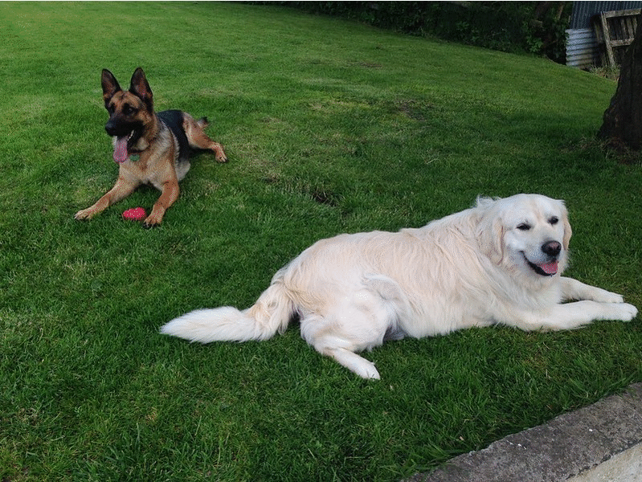

# Remove backgrounds and cut out objects from pictures with AI

This works by first detecting objects with [Detectron2](https://github.com/facebookresearch/detectron2) , then cutting out the desired masks with [openCV](https://opencv-python-tutroals.readthedocs.io/en/latest/py_tutorials/py_setup/py_intro/py_intro.html#intro) and cropping out the object to its bounding boxes.

[Detectron2](https://github.com/facebookresearch/detectron2) is Facebook AI Research's next generation software system that implements state-of-the-art object detection algorithms. **There is no GPU required if you use pretrained models**
 
[List of currently supported objects](https://github.com/DDemmer1/ai-background-remove/blob/master/supported_objects.txt)

<p align="center">
  
</p>

The extracted objects are not cut out pixel-perfect, but it can be a tremendous workload reduction to be able to process thousands of images at once. For example as a data set for other ML applications. 

## Installation

-1. Installing Detectron2 on **Linux** systems is pretty straightforward. 

For **Windows 10**, a relatively easy solution is to install the Windows subsystem for Linux, instructions here: https://docs.microsoft.com/en-us/windows/wsl/install-win10. You will have to install the following packages as well (in the shell): python, python-dev and opencv-python.

For **OS X**, you can try to follow the Anaconda instructions posted here: https://medium.com/deepvisionguru/how-to-embed-detectron2-in-your-computer-vision-project-817f29149461. Please note that this is not yet compatible with our demo.py script, we hope to fix that soon.

0. Clone this repository and enter folder (or download, extract and enter folder):
```
git clone https://github.com/DDemmer1/ai-background-remove.git
```
```
cd ai-background-remove
```
1. Create **virtual environment** to make sure we don't mess with your system python install and install all needed packages:

If you have a **Conda** python install, try this:
```
conda create --nsame detectron2
```
```
conda activate detectron2
```


For **vanilla python**, try this:
```
python -m venv detectron2
```
```
source detectron2/bin/activate
```
```
pip install -r detectron2/requirements.txt
```
2. Install precompiled Detectron2 with CPU support only:
```
pip install detectron2 -f https://dl.fbaipublicfiles.com/detectron2/wheels/cpu/index.html
```
OR: Install precompiled Detectron2 for CUDA 10.1:
```
pip install detectron2 -f https://dl.fbaipublicfiles.com/detectron2/wheels/cu101/index.html
```  
3. Create a new Jupyter kernel which uses the virtual environment you have just created:
```
ipython kernel install --user --name=detectron2
```

## Run the pretrained model

1. Copy your images with the objects to extract to ai-background-remove/input

2. Run the following network: 
(If you use a Python version **other than 3.7**. Make sure to change the version in the path )


```
python detectron2/demo.py --config-file detectron2/lib/python3.7/site-packages/detectron2/model_zoo/configs/COCO-PanopticSegmentation/panoptic_fpn_R_101_3x.yaml --input input/* --output output  --opts MODEL.DEVICE cpu MODEL.WEIGHTS detectron2://COCO-PanopticSegmentation/panoptic_fpn_R_101_3x/139514519/model_final_cafdb1.pkl
```

3. Detected objects are marked and a visualization is saved in your /output folder. 


## Object Extraction

Run Jupyter notebook

```
jupyter notebook
```

For **background removal** open **bg-remove.ipynb** and make sure the **'detectron2' kernel** is used and run the cells

If you want to instead **analyse** your input corpus open **deep_watching.ipynb** and run the cells (make sure the **'detectron2' kernel** is used)

### If you want to know how to label pictures and train your own networks have a look at https://github.com/ghowa/dhd2020

